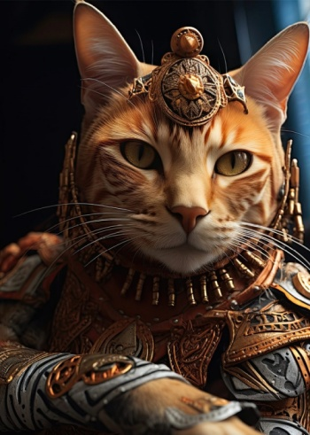
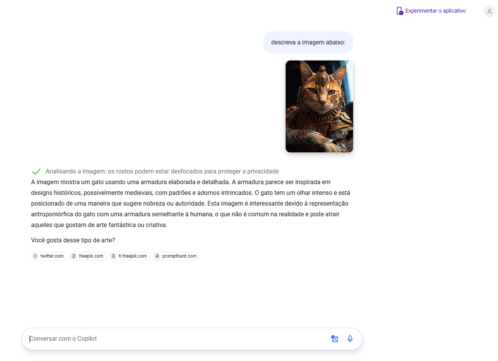
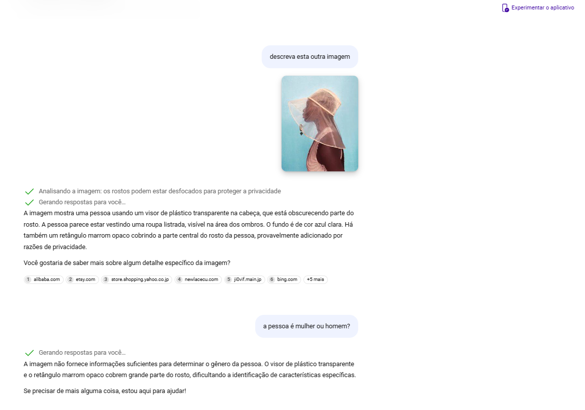

# Explorando os Recursos de IA Generativa com Copilot e OpenAI

### Inputs das imagens

1. Utilizei esta imagem abaixo no prompt do Copilot:

- Com a descrição: "descreva a imagem abaixo"

 

2. Depois utilizei esta imagem abaixo no prompt do Copilot:

- Com a descrição: "descreva esta outra imagem"

### Outputs das imagens

1. O resultado da primeira imagem gerada pelo o Copilot: 

2. O resultado da segunda imagem também gerada pelo o Copilot: 

 

## CONTATO

- **LinkedIn:** [Edilson Freire](https://www.linkedin.com/in/edilson-freire-37a06ab1/)
- **Email:** analistadesistemasedilson@gmail.com
- **Linkdin:** [Edilson Freire](https://www.linkedin.com/in/edilson-freire-37a06ab1/)